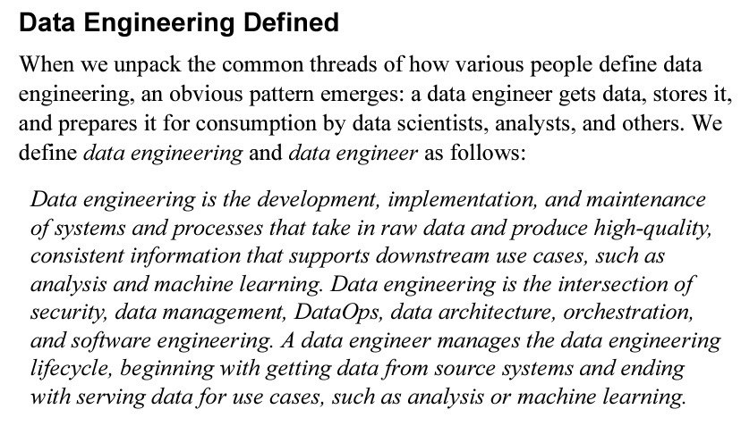
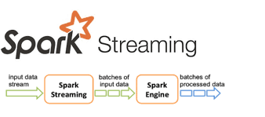
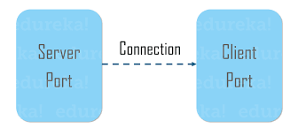

# Pyspark Structured Streaming from Socket source

## Project Description

This is a Spark streaming program that reads a text file, sends it content through a socket streaming session and aggregates the count of each word.

The text file is an extract of the defination for data engineering given by Joe Reis and & Matt Housley in their book "Fundamentals of Data Engineering", a good read :+1: :+1:.

## Project Objective

To demonstrate a simple Spark socket streaming with aggregation using PySpark. The socket is a TCP socket session between a local server (`127.0.0.1:5011`) endpoint and a remote client endpoint (`127.0.0.1:<spark defines the port>`).

 

>- Used python to read the text file and refining it lines by removing commas and periods.

>- Established a TCP socket connection with python's built-in socket module.

>- Create a spark session, spark readstream object and a socket output spark writestream object.

>- Performed a word count aggregation on the streaming data.

## Setup/How to run

- Inside the cloned repo, create your virtual env, and run **`pip install -r dependencies.txt`** in the activated virtual env to set up required libraries and packages.

- Activte the virtual env.

- It would be a good idea to split the terminal, run **`python server_socket.py`** *(the local server)*  then **`python pyspark_socket_streaming.py`** *(the remote client)* in the terminal.

- Should in case a need comes to end the server_socket.py while running, use `CTRL+C` not `CTRL+Z` as that only suspends the program and not freeing the socket resource port in use.

- In error *socket already in use*, run **`lsof -i:5011`** to see the running process in your terminal. Use **`kill -9 <PID_NUMBER>`** to end the process so as to free the port.

## Improving our project

- We can include scheduling and orchestration with Apache Airflow.

Having any issues, reach me at this [email](oluwatobitobias@gmail.com). More is definitely coming, do come back to check them out.

Now go get your cup of coffee/tea and enjoy a good code-read and criticism :+1: :+1:.
